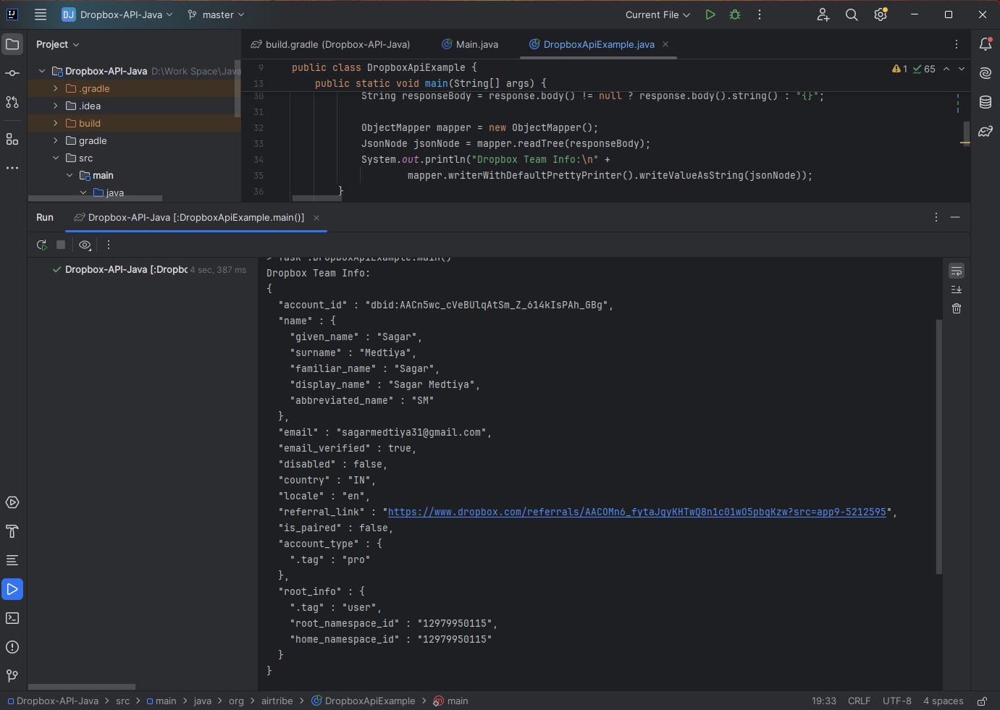

# Dropbox API Example in Java

This project demonstrates how to implement authentication and fetch user account details using the Dropbox API in Java with OkHttp and Jackson.

## 📌 Features

- Uses OkHttpClient for making HTTP requests
- Authenticates with Dropbox via Bearer Token
- Fetches current account information from Dropbox
- Pretty prints JSON response with Jackson

## 🚀 How to Run

Clone the repository:

```
git clone https://github.com/<your-username>/<your-repo>.git
cd <your-repo>
```

Replace the placeholder with your Dropbox access token:

```
private static final String ACCESS_TOKEN = "YOUR_ACCESS_TOKEN";
```

Compile & run the program in IntelliJ IDEA (or with Gradle/Maven).

Example with `javac`:

```
javac -cp ".;libs/*" DropboxApiExample.java
java -cp ".;libs/*" DropboxApiExample
```

## ✅ Example Output

When run successfully, the program prints your Dropbox account details in JSON format:

```
Dropbox Team Info:
{
  "account_id" : "dbid:AACn5wc_cVeBUlqAtSm_Z_614kIsPAh_GBg",
  "name" : {
    "given_name" : "Sagar",
    "surname" : "Medtiya",
    "familiar_name" : "Sagar",
    "display_name" : "Sagar Medtiya",
    "abbreviated_name" : "SM"
  },
  "email" : "sagarmedtiya31@gmail.com",
  "email_verified" : true,
  "disabled" : false,
  "country" : "IN",
  "locale" : "en",
  "referral_link" : "https://www.dropbox.com/referrals/AACOMn6_fytaJgyKHTwQ8n1c01wO5pbgKzw?src=app9-5212595",
  "is_paired" : false,
  "account_type" : {
    ".tag" : "pro"
  },
  "root_info" : {
    ".tag" : "user",
    "root_namespace_id" : "12979950115",
    "home_namespace_id" : "12979950115"
  }
}
```

## 🖼 **Screenshot**

Here’s the screenshot of the compiler/output:



🛠 **Dependencies**

- OkHttp
- Jackson Databind

Add them via Maven/Gradle or download JARs and include in your project.
